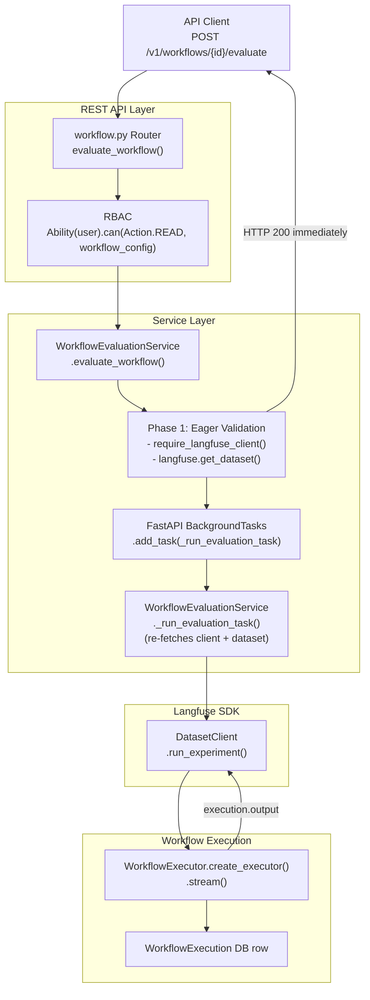

# Workflow Evaluation with Langfuse Datasets — Design Spec

**Ticket**: EPMCDME-13369
**Branch**: EPMCDME-13369_workflow-evaluation-langfuse
**Date**: 2026-07-07

---

## Goal

Add `POST /v1/workflows/{workflow_id}/evaluate` — an endpoint that runs every item in a Langfuse
dataset through a workflow and records the results as a named experiment in the Langfuse UI.

The feature follows the same two-phase pattern as the existing assistant evaluation: synchronous
eager validation returns an immediate HTTP 200 or a typed error; the actual item-by-item execution
runs in a FastAPI `BackgroundTask`.

---

## Architecture

---

## Components

### `WorkflowEvaluationRequest` — `src/codemie/core/workflow_models/workflow_models.py`

New Pydantic request model. Exported from `src/codemie/core/workflow_models/__init__.py`.

**Contract:**

| Field | Required | Default | Purpose |
|---|---|---|---|
| `dataset_id` | Yes | — | ID or name of the Langfuse dataset containing input items |
| `experiment_name` | Yes | — | Labels the experiment run in the Langfuse UI, grouping all item traces together |
| `max_concurrency` | No | `1` | Number of items processed concurrently; constrained to the range `[1, 5]` |

---

### `EvaluationResponse` — `src/codemie/service/workflow_evaluation_service.py`

New Pydantic response model extending `BaseResponse`.

**Contract:** carries `message: str` and `experiment_name: str`. Returned immediately on HTTP 200
before any items are processed.

---

### `WorkflowEvaluationService` — `src/codemie/service/workflow_evaluation_service.py`

New service class. Central orchestrator for the evaluation feature. Implements the two-phase
pattern.

**`evaluate_workflow()` — Phase 1 (synchronous)**

Responsibility: validate all preconditions before accepting the request.

1. Calls `require_langfuse_client()` — raises HTTP 503 if Langfuse is unavailable.
2. Calls `langfuse.get_dataset(dataset_id)` — raises HTTP 400 if the dataset cannot be resolved.
3. Schedules `_run_evaluation_task` via `BackgroundTasks`, passing `dataset_id`, `experiment_name`,
   `max_concurrency`, `workflow_config`, `user`, and `raw_request` as keyword arguments. The
   background task re-fetches the client and dataset (see below), consistent with
   `AssistantEvaluationService`; the eagerly-fetched `DatasetClient` is used only for validation.
4. Returns `EvaluationResponse` immediately.

**`_run_evaluation_task()` — Phase 2 (background)**

Responsibility: drive the experiment loop via the Langfuse SDK.

Re-fetches the Langfuse client via `require_langfuse_client()` and the dataset via
`langfuse.get_dataset(dataset_id)` inside the background task (consistent with the existing
`AssistantEvaluationService` pattern), then calls
`dataset.run_experiment(name=experiment_name, task=<item_task>, max_concurrency=max_concurrency)`.
The item task callable is defined inline and has the following contract:

- Receives a single `DatasetItem` from the SDK; uses `item.input` as the workflow `user_input`.
- Creates a `WorkflowExecution` DB record via `WorkflowService.create_workflow_execution()`, passing
  `user.as_user_model()` (the service expects a `UserEntity`, not the `User` security object).
- Builds and runs a `WorkflowExecutor` in blocking background mode (`executor.stream()`), which
  blocks until the workflow finishes.
- Re-fetches the completed execution via `WorkflowService.find_workflow_execution_by_id()` and
  returns `execution.output` to the SDK, which records it as the experiment output for that item.
- On any per-item exception: logs the error and returns `None` so the SDK records a null output and
  the experiment continues with the next item.

---

### `evaluate_workflow` endpoint — `src/codemie/rest_api/routers/workflow.py`

New route added to the existing workflow router.

**Contract:**

- `POST /v1/workflows/{workflow_id}/evaluate`
- Authentication: `authenticate` dependency (JWT/session).
- Request body: `WorkflowEvaluationRequest` — a plain `BaseModel`, so JSON keys are snake_case
  (`dataset_id`, `experiment_name`, `max_concurrency`).
- Authorization: `Ability(user).can(Action.READ, workflow_config)` — READ access is sufficient,
  consistent with the assistant evaluator. Denial calls `raise_access_denied("evaluate")`, which
  raises HTTP 401 (the codebase's standard access-denied response).
- Resolves the workflow config via `WorkflowService().get_workflow(workflow_id, user)` inside a
  `try/except`; any exception calls `raise_not_found(...)` → HTTP 404.
- Delegates to `WorkflowEvaluationService.evaluate_workflow()` synchronously (the eager validation
  runs before the response is returned) and returns its `EvaluationResponse`. Because
  `EvaluationResponse` extends `BaseResponse`, the response JSON is serialized with camelCase aliases
  (e.g., `experimentName`).

---

## Error Handling

| HTTP Code | Condition |
|---|---|
| 404 | `workflow_id` not found (via `raise_not_found`) |
| 401 | User lacks READ access to the workflow (via `raise_access_denied`) |
| 503 | `codemie-enterprise` not installed or `LANGFUSE_TRACES=false` |
| 400 | `dataset_id` cannot be resolved in Langfuse |
| logged + skipped | Individual item execution failure — experiment continues |

---

## Tests

- `tests/codemie/service/test_workflow_evaluation_service.py` (new) — unit tests for
  `evaluate_workflow` and `_run_evaluation_task`; mock `require_langfuse_client`, `WorkflowService`,
  `WorkflowExecutor`, and `DatasetClient.run_experiment`
- `tests/codemie/rest_api/routers/test_workflow.py` — add tests for the new endpoint covering 200,
  404, 401 (access denied), 503, and 400

> **Implementation note:** The router tests mock `WorkflowService.get_workflow`, `Ability.can`, and
> `WorkflowEvaluationService.evaluate_workflow` (patched at the router module path). The service
> tests capture the inline `item_task` passed to `dataset.run_experiment` and invoke it directly to
> assert the success (`execution.output`) and error (`None`) paths.

---

## Out of Scope

- No changes to `AssistantEvaluationService` or any assistant evaluation code
- No automatic scoring or evaluators — can be added later via the `evaluators=` parameter of
  `run_experiment()`
- No streaming per-item execution — full output must be captured before the item task returns
- No conversation history across items — each item is evaluated in isolation with a fresh execution
- No frontend changes
